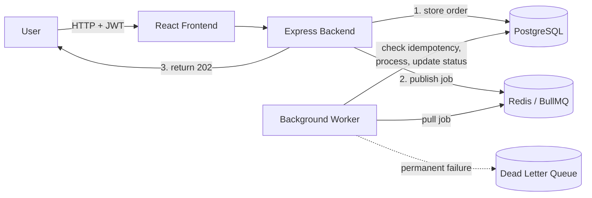
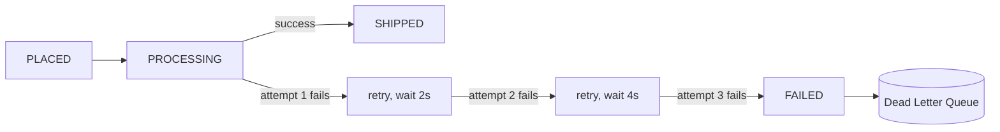

# BrewFlow — Async Order Processing Platform

A full-stack cafe ordering system built to demonstrate production backend engineering, not just CRUD: queue-based async processing, fault tolerance with retries and a dead-letter queue, idempotent workers, JWT auth, and a Dockerized deployment. "BrewFlow" is the product skin (The Daily Grind); the engineering underneath is a general-purpose async order pipeline.

**Live:** [brewflow-ind.vercel.app](https://brewflow-ind.vercel.app) (frontend) · [brewflow-api-wpek.onrender.com](https://brewflow-api-wpek.onrender.com) (API, free-tier Render — first request may take a few seconds to wake up) · [`/health`](https://brewflow-api-wpek.onrender.com/health) (live Postgres + Redis check)

---

## Architecture




The API responds as soon as the order is durably stored and the job is queued — it never waits on the actual order processing. That work happens in the background worker, decoupled from the request/response cycle.

---

## Why this exists

Most portfolio CRUD apps stop at "save to database, return 200." BrewFlow is built around the reliability problems that show up the moment you take work off the request path: what happens when a worker crashes mid-job, when the same job gets delivered twice, when a downstream call times out versus genuinely fails — and it answers each of those with a real mechanism (below), not just a comment.

## Reliability features

**Order-before-queue ordering.** The order is written to Postgres *before* the job is published — if a job could exist in the queue with no matching order row, a worker picking it up would process an order that doesn't exist. Postgres is the source of truth; the queue is just a trigger.

**Retry with exponential backoff.** Transient failures (DB timeout, network blip, temporary service unavailability) retry automatically — 2s, 4s, 8s — instead of failing the job outright.

**Failure classification.** Not every failure deserves a retry: invalid order data, a missing user, or a corrupted payload fail fast instead of burning through retry attempts on something that will never succeed.

**Idempotent workers.** Before processing, a worker checks the order's current state and skips if it's already been handled — protects against duplicate processing, duplicate payments, duplicate notifications if a job is ever delivered more than once (queues generally guarantee *at-least-once* delivery, not exactly-once).

**Dead Letter Queue.** Jobs that exhaust their retries land in a DLQ with the failure reason, retry count, and original job details attached — a recovery candidate for manual review, instead of a silently dropped order.

**Structured logging.** Every log line is JSON (`timestamp`, `level`, `message`, `jobId`, `attempt`, …) — built for grepping/aggregating, not just reading in a terminal.



---

## Tech stack

| Layer | Stack |
|---|---|
| Frontend | React, Vite, TailwindCSS |
| Backend | Node.js, Express, Prisma ORM |
| Database | PostgreSQL (Neon) |
| Queue | Redis, BullMQ |
| Infra | Docker, Docker Compose, Render (API) + Vercel (frontend) |

## Project structure

```text
backend/
├── src
│   ├── auth
│   ├── controllers
│   ├── middleware
│   ├── repositories
│   ├── routes
│   ├── services
│   ├── workers
│   ├── queues
│   ├── logger
│   └── utils
├── prisma
└── server.js

frontend/
└── src
    ├── pages
    ├── components
    ├── services
    └── App.jsx
```

## Running it locally

```bash
docker compose up --build
docker compose exec backend npx prisma db push   # apply schema
```

Frontend: `http://localhost:5173` · Backend: `http://localhost:3000`

## Current features

- **Auth:** signup, login, JWT, protected routes
- **Orders:** create, dashboard, ownership validation
- **Async processing:** Redis queue, background worker, retries with exponential backoff
- **Reliability:** dead letter queue, idempotency, failure classification, structured logging
- **Infra:** fully Dockerized, PostgreSQL + Redis

## Roadmap (not yet built)

Multiple concurrent workers, race-condition/optimistic-locking handling, metrics + monitoring, WebSocket order-status push, horizontal scaling, distributed tracing.

---

[Vedang Paithankar](https://github.com/VedangPaithankar)
