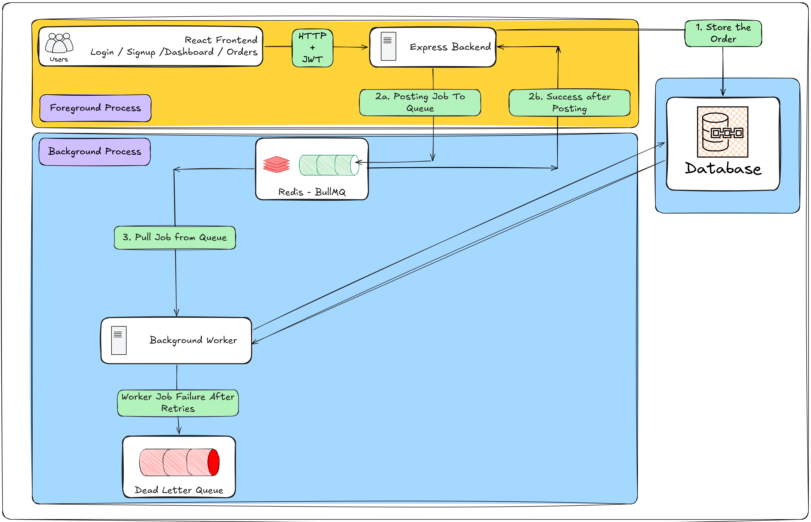

# Async Order Processing Platform

A full-stack asynchronous order processing system demonstrating production backend engineering concepts including queue-based processing, fault tolerance, retries, idempotency, JWT authentication, and Dockerized deployment.

---

# Architecture



---

# Overview

This project simulates a real-world order processing platform where user requests are immediately accepted while expensive work is processed asynchronously in the background.

The system is designed around reliability and scalability principles:

- JWT Authentication
- Queue-based architecture
- Background workers
- Retry mechanism
- Idempotent processing
- Dead Letter Queue
- Structured logging
- Dockerized deployment

---

# High Level Flow

## Foreground Flow

```text
User
    ↓
React Frontend
    ↓
HTTP + JWT
    ↓
Express Backend
    ↓
Store Order in PostgreSQL
    ↓
Publish Job to Queue
    ↓
Return Success Response
```

The API responds immediately without waiting for order processing.

---

## Background Flow

```text
Worker
    ↓
Pull Job from Queue
    ↓
Check Idempotency
    ↓
Process Order
```

Successful execution:

```text
PLACED
    ↓
PROCESSING
    ↓
SHIPPED
```

Failure execution:

```text
Attempt 1
    ↓
Attempt 2
    ↓
Attempt 3
    ↓
FAILED
    ↓
Dead Letter Queue
```

---

# Architecture Decisions

## Why store order before publishing to queue?

Current flow:

```text
Store Order
      ↓
Publish Job
      ↓
Return Success
```

Reason:

If a job enters the queue before an order exists:

```text
Queue Job Exists
Order Record Missing
```

This creates orphan processing.

PostgreSQL acts as the system source of truth.

---

# Reliability Features

## Retry Mechanism

Transient failures automatically retry using exponential backoff:

```text
Attempt 1
Wait 2 sec

Attempt 2
Wait 4 sec

Attempt 3
Wait 8 sec
```

Retries help recover from:

- temporary database failures
- network issues
- transient service failures

---

## Failure Classification

Retryable:

- Database timeout
- Network failures
- Temporary service unavailability

Non-retryable:

- Invalid order data
- Missing user
- Corrupted payload

---

## Idempotency

Workers verify current order state before processing:

```text
Already processed?
        ↓
    Yes → Skip
    No → Continue
```

This prevents:

- duplicate processing
- duplicate payments
- duplicate notifications

---

## Dead Letter Queue

Permanently failed jobs are moved into a Dead Letter Queue.

Stored information:

- Job details
- Failure reason
- Retry count
- Recovery candidate

This prevents silent failures.

---

## Structured Logging

Example:

```json
{
  "timestamp":"2026-05-18T12:00:00Z",
  "level":"ERROR",
  "message":"Order processing failed",
  "jobId":"123",
  "attempt":2
}
```

Logs improve:

- debugging
- monitoring
- operational visibility

---

# Tech Stack

## Frontend

- React
- Vite
- TailwindCSS

---

## Backend

- Node.js
- Express
- Prisma ORM

---

## Database

- PostgreSQL

---

## Queue System

- Redis
- BullMQ

---

## Infrastructure

- Docker
- Docker Compose

---

# Project Structure

```text
backend/

├── src
│   ├── auth
│   ├── controllers
│   ├── middleware
│   ├── repositories
│   ├── routes
│   ├── services
│   ├── workers
│   ├── queues
│   ├── logger
│   └── utils
│
├── prisma
│
└── server.js


frontend/

├── src
│   ├── pages
│   ├── components
│   ├── services
│   └── App.jsx
```

---

# Running the Project

Start all services:

```bash
docker compose up --build
```

Apply database schema:

```bash
docker compose exec backend npx prisma db push
```

Open application:

```text
Frontend:
http://localhost:5173

Backend:
http://localhost:3000
```

---

# Current Features

Authentication:

- Signup
- Login
- JWT Authentication
- Protected Routes

Orders:

- Create Order
- Order Dashboard
- Ownership Validation

Async Processing:

- Redis Queue
- Background Worker
- Retry Mechanism
- Exponential Backoff

Reliability:

- Dead Letter Queue
- Idempotency
- Failure Classification
- Structured Logging

Infrastructure:

- Dockerized deployment
- PostgreSQL
- Redis

---

# Future Improvements

Planned Phase 3 work:

- Multiple workers
- Concurrency handling
- Race condition handling
- Optimistic locking
- Metrics collection
- Monitoring
- WebSockets
- Horizontal scaling
- Distributed tracing

---

# Author

Vedang Paithankar